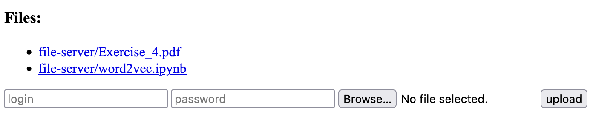

# Description of the assignment

1. Prepare the "administrative" Linux system similar to the „rescue” system used in our lab:
   1. working in initramfs
   2. equipped with the tools necessary to manage the SD card (partition it, format it, copy the new version of the system via a network, etc.). Particularly this system will be used to split the SD card into 3 partitions:
      1. VFAT with the rescue system (in „rescue” subdirectory), the administrative system and the kernel of the usr system (in the „user” subdirectory) (in fact it should be the original first partition),
      2. ext4 – with the rootfs of the user system,
      3. ext4 – with the data of the user system.
2. Prepare a "utility" Linux operating system using the ext4 on the 2nd partition as its root file system. This system should provide the web server (implemented with Tornado, or equivalent framework) controlled via WWW interface.
   1. The server should serve files located on the 3rd partition (displaying the list of files and allowing selection of file to download).
   2. The server should also allow the authenticated users to upload new files to the 3rd partition.
3. Prepare the bootloader enabling selecting between the administrative and the user system. Cautions! That bootloader should be started by the original bootloader based in the RPi firmware. It should be run as its user system. Due to limitations of the RPi, our bootloader must pass to the loaded kernel the kernel parameters and the device tree provided by the original bootloader.
   1. The WHITE LED should signal, that the buttons will be checked
   2. After one second, the buttons should be read to select the system. If the chosen button is NOT pressed, the „utility” system should be loaded. If the chosen button is pressed, the „administrative” system should be loaded.
   3. After selection of the system, the WHITE led should be switched off. The GREEN LED should be ON if the „utility” system was selected. The RED LED should be ON if the „administrative” system was selected.

# Procedure to recreate the design from the attached archive

After unpacking the attached archive `wojnarowskim_lab3.tar.gz` there will be a `setup.sh` script. Running it will download buildroot, copy over config files, change the size of the vfat partition, and finally make the images. In this lab, however, many manual work with moving images around, creating partitions etc is required, thus I have failed to automate it. Hopefully the report describes all steps needed.

\newpage

# Description of the solution

## Admin system

The admin system was supposed to serve the similar purpose as the existing rescue system on RPi. In this buildroot config the goal was to produce the U-Boot bin image and the image for the admin system (with initramfs).

To do that, first U-Boot was enabled with `BR2_TARGET_UBOOT`. This will be enough to produce the bootloader image. Additionally, we want to run a custom uboot script so `BR2_PACKAGE_UBOOT_TOOLS` was enabled together with the mkimage tool: `BR2_PACKAGE_UBOOT_TOOLS_MKIMAGE`. The u-boot script was the following:

```sh
fdt addr ${fdt_addr}
fdt get value bootargs_orig /chosen bootargs
mmc dev 0

gpio clear 22
gpio set 23
sleep 1

if gpio input 10 ; then
    fatload mmc 0:1 ${kernel_addr_r} user/Image.admin
    setenv bootargs "${bootargs_orig} console=ttyAMA0"
    gpio clear 23
    gpio set 27
    booti ${kernel_addr_r} - ${fdt_addr}
else
    fatload mmc 0:1 ${kernel_addr_r} user/Image.user
    setenv bootargs "${bootargs_orig} console=ttyAMA0"
    gpio clear 23
    gpio set 22
    booti ${kernel_addr_r} - ${fdt_addr}
fi
```

On a high level it does the following:

1. Set the green diode to low (it indicates the user system was booted, but we don't need it)
2. Set our indicator diode (orange-ish color) and wait for a second
3. Check whether the button was pressed
4. If yes, boot the admin system otherwise boot the user system
5. Cleanup diodes and set the appropriate one based on the system that was booted

Then since it is an administrative system packages for managing file system were enabled; such programs as `fdisk`, `mkfs.ext4`, `mkfs.vfat`, `fsck`, resizing tools etc were then available.

After building with `make` we get produced two images: `u-boot.bin` and `Image`. We first move `Image` into `user/Image` on RPi to be able to boot into it. Once there, the system partitions were created using the tools previously mentioned: one vfat (which was already there) and two ext4 of some appropriate size to fit the files and fs image (with `fdisk` and `mkfs.ext4`). Additionally the boot script was then created with the `mkimage` tool by first downloading the previously created `boot.txt` file and then issuing the following command:

```sh
mkimage -T script -C none -n 'Start script' -d boot.txt boot.scr
```

The generated file (`boot.scr`) was placed in the root of the vfat partition. Our bootloader is now ready and we proceed to enable it by first moving our admin image to `user/Image.admin` and `u-boot.bin` to `user/Image`. Rebooting into the admin system (by holding the button on the RPi) and running `mount` shows that we have not mounted any additional partitions for the admin system and the size of the image is an indicator that indeed we are using initramfs.

\newpage

## User system

The user system was built as a separate buildroot configuration. After the usual initial setup the following things were done:

1. Disable initramfs, use rootfs ext4. Here compression was not enabled due to the post build script not taking into account and failing to locate the fs image.
2. Enable python `BR2_PACKAGE_PYTHON3` and needed libraries (just one: `BR2_PACKAGE_PYTHON_FLASK`). Will be needed for our web server. For convenience the readline package for python was enabled as well.
3. Enable rootfs overlay (`BR2_ROOTFS_OVERLAY="../user-overlay"`)
4. Enable busybox's `screen`

Then we simply create the image with `make` and move the generated image to `user/Image.user` on RPi's vfat partition. Since we are also using rootfs it has to be flashed onto the previously created second partition. To do that, while being on the administrative system the following command was issued (after hosting the `output/images` buildroot folder on our host):

```sh
wget 192.168.145.xxx:8000/rootfs.ext4 -O- | dd of=/dev/mmcblk0p2 bs=4096
```

We may now boot into the system by rebooting and not holding any buttons. Diode turns green (as opposed to red with the admin system) and the file-server is immediately started and can be reached on the `5000` port. Additionally, to add a definite differentiator of the user and admin system, the host name is different: `marcin_user` and `marcin_admin` respectively. Finally, we run `mount` and see that indeed we have mounted both the second and third partition and we are therefore using the rootfs.

### Rootfs overlay

As mentioned before, we have a custom rootfs overlay, it consists of two things:

1. `etc/init.d/S50fileserver` - a script that was marked executable (with `chmod +x`) that will be executed at startup; and its contents are:

```sh
#!/bin/sh

if [ "$1" = "start" ]; then
    mkdir /file-server || true
    mount /dev/mmcblk0p3 /file-server
    screen -dmS file_server python3 /opt/file-server/main.py /file-server
fi
```

We check whether we are at startup, we create a folder where the 3rd partition will be mounted, and start our python file server as a `screen` daemon pointing it to the 3rd partition (it will manage files of that folder).

2. `opt/file-server` - the python server hosting the files.

As in the requirements, it shows a list of files and allows uploading new files for authenticated users. For authentication HTTP's basic auth was used (user:password). Additionally by clicking the displayed list of files one can download it locally. Below is a screenshot of the running file-server interface.



# Attached archive

```
.
|-- .config.admin
|-- .config.user
|-- boot.txt
|-- setup.sh
`-- user-overlay
    |-- etc
    |   `-- init.d
    |       `-- S50fileserver
    `-- opt
        `-- file-server
            |-- Pipfile
            |-- Pipfile.lock
            |-- main.py
            |-- templates
            |   `-- index.html
            `-- util.py
```
