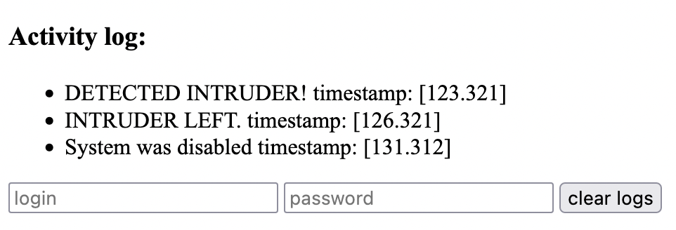

# Description of the assignment

The subject of assignment 4 is the implementation (with the Raspberry Pi, the extension board and maybe an additional I/O module) of a device equipped with two forms of the user interface.

1. simple buttons and LEDs should be used to control basic functions,
2. web interface (or other network interface) should be used to control advanced functions.

To implement the device, you can use the modules included in the set of sensors and modules available in the laboratory (due to the limited number of sets, the use of a specific module should be agreed with the teacher). Alternatively, you can also attach your own USB device to the board (e.g. webcamera, sound card, etc.). The functionality of the proposed device can be planned independently and agreed with the teacher.

# Procedure to recreate the design from the attached archive

After unpacking the attached archive `wojnarowskim_lab4.tar.gz` there will be a `setup.sh` script. Running it will download buildroot, copy over config files, change the size of the vfat partition, and finally make the image.

# Description of the solution

### I/O module

For this lab the motion detector module was chosen ([link](https://botland.store/motion-sensors/1655-pir-hc-sr501-motion-detector-green-5903351241359.html)). To connect it to our extension board only three cables were needed:

1. GND - connected to ground
2. VCC - connected to 5V (compatible with 3.3V)
3. OUT - connected to gpio pin, in this case it was connected to lane `21`

On OUT the signal was sent to the GPIO lane, when HIGH an object was detected. When low, no object is detected.

### Rootfs overlay

To run the web interface, we have a custom rootfs overlay, it consists of two things:

1. `etc/init.d/S50fileserver` - a script that was marked executable (with `chmod +x`) that will be executed at startup; and its contents are:

```sh
#!/bin/sh

if [ "$1" = "start" ]; then
    screen -dmS file_server python3 /opt/file-server/main.py
fi
```

We check whether we are at startup and start our python file server as a `screen` daemon which will allow us to layer reattach and inspect the process.

1. `opt/file-server` - the python server web interface with motion logs

It runs a http server with a simple interface showing all of the logs (detected movement by the motion detector) and authenticated users are able to clear all of the logs. Below is a screenshot of the running file-server interface.



### Application

> This application uses `python3`, `flask`, and `libgpiod`.

The functionality of this device is the following: A python server is started and listens on the GPIO motion sensor lane (in this case it is the `21` lane). When HIGH is received (motion detected) a note is made and persisted to a log file with a timestamp of the incident. Example: "_DETECTED INTRUDER! timestamp: [123.312]_". Additionally, all LEDs on the board are flashing as long as motion is being detected. Once the signal is LOW again a second note is added: "_INTRUDER LEFT. timestamp: [128.321]_", and all LEDs go back to being off. When the first button is pressed (lane `25`) the system is considered disarmed and will not log any motion detection and a green LED will remain on to indicate that the system is disarmed. Upon pressing the same button, the system becomes armed once again and the green LED turns itself off.

In the web interface, one can inspect the logs and clear them upon proper authentication.

This system is a simple recreation of a house alarm sensors system. This could be extended to instead of persisting to a log file, the reports could be sent to some remote HQ. Similar to how house security companies work. Additionally, instead of pressing a single button to disarm the system, a passcode could be used instead.

# Description of the modifications of BR and kernel configurations

Buildroot configuration:

1. TTY port - `console`
2. Primary download site - `192.168.137.24/dl`
3. Select the toolchain - external, AArch64 2021.07
4. Enable `CCACHE`, `BR2_CCACHE_DIR` set to `../ccache-br`
5. Filesystem images set to "initial RAM filesystem linked into linux kernel" with ext4, size increased to 256M (both here and in `board/raspberrypi4-64/genimage-raspberrypi4-64.cfg`)
6. Set gzip compression for image
7. Enable libgiod with `BR2_PACKAGE_LIBGPIOD`
8. Make sure `BR2_PACKAGE_ZLIB` is enabled
9. Enable python3 with `BR2_PACKAGE_PYTHON3`
10. Enable flask lib with `BR2_PACKAGE_PYTHON_FLASK`
11. Set `BR2_ROOTFS_OVERLAY` to `../user-overlay` (for startup script and python application)

# Attached archive

```
.
|-- .config
|-- setup.sh
`-- user-overlay
    |-- etc
    |   `-- init.d
    |       `-- S50fileserver
    `-- opt
        `-- file-server
            |-- Pipfile
            |-- Pipfile.lock
            |-- gpio.py
            |-- main.py
            |-- templates
            |   `-- index.html
            `-- util.py
```
